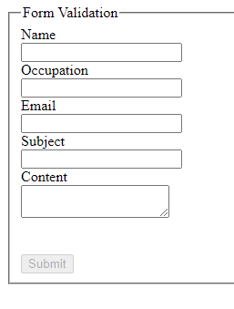

# Lab82

## Requirements

For this lab you'll build a simple contact form component that must meet the specs below: 

1. 1. It will have the fields, name, occupation, email, subject, and content. 
   2. Every field is required but occupation.
   3. Content must be a textarea field and has a minimum length of 10 and a maximum length of 255 characters.
   4. You must highlight all invalid fields and show error messages.
   5. The email must be a valid email address.
   6. After successful submission, you must disable all inputs and disable the submit button (you can only send the contact form successfully once).

This project was generated with [Angular CLI](https://github.com/angular/angular-cli) version 11.2.1.

## Development server

Run `ng serve` for a dev server. Navigate to `http://localhost:4200/`. The app will automatically reload if you change any of the source files.

## Code scaffolding

Run `ng generate component component-name` to generate a new component. You can also use `ng generate directive|pipe|service|class|guard|interface|enum|module`.

## Build

Run `ng build` to build the project. The build artifacts will be stored in the `dist/` directory. Use the `--prod` flag for a production build.

## Running unit tests

Run `ng test` to execute the unit tests via [Karma](https://karma-runner.github.io).

## Running end-to-end tests

Run `ng e2e` to execute the end-to-end tests via [Protractor](http://www.protractortest.org/).

## Further help

To get more help on the Angular CLI use `ng help` or go check out the [Angular CLI Overview and Command Reference](https://angular.io/cli) page.
